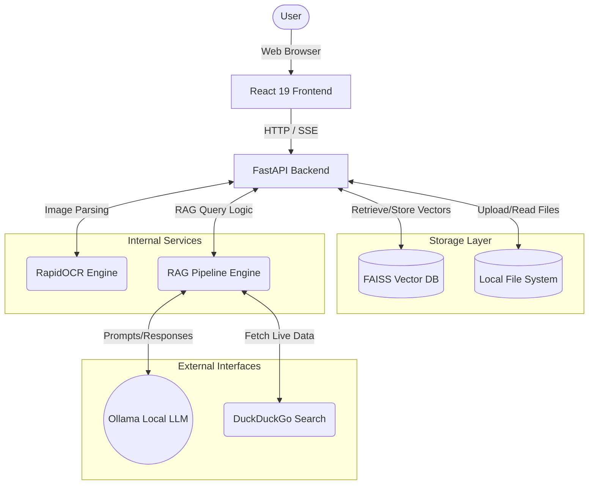
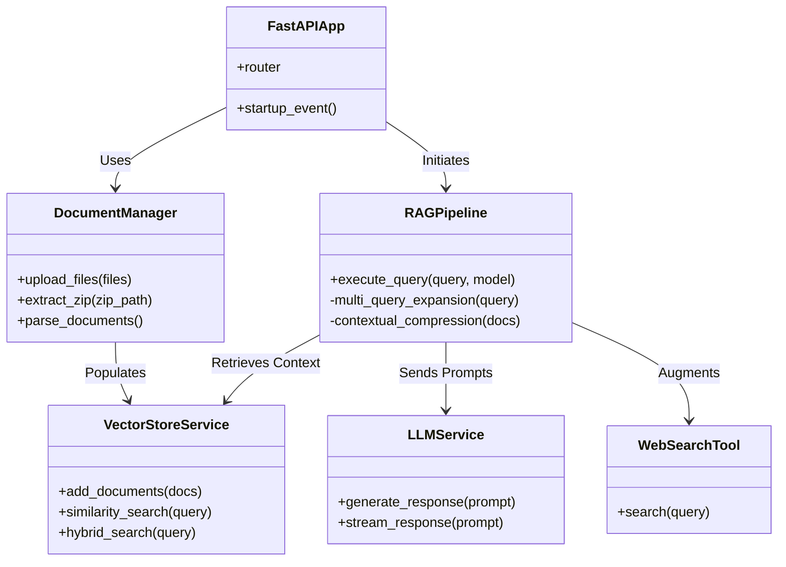
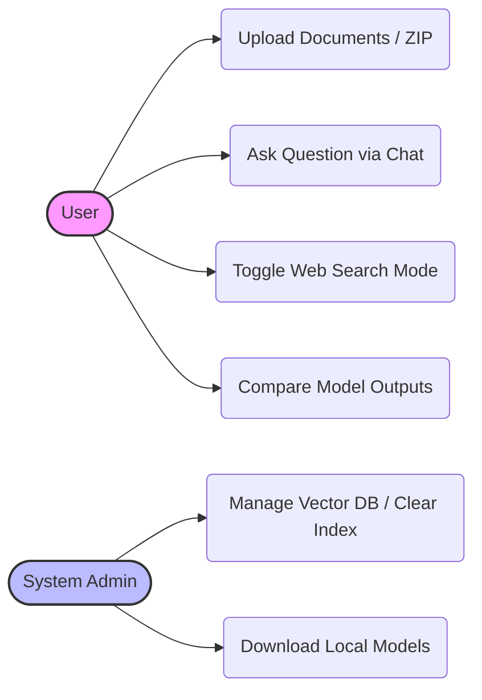
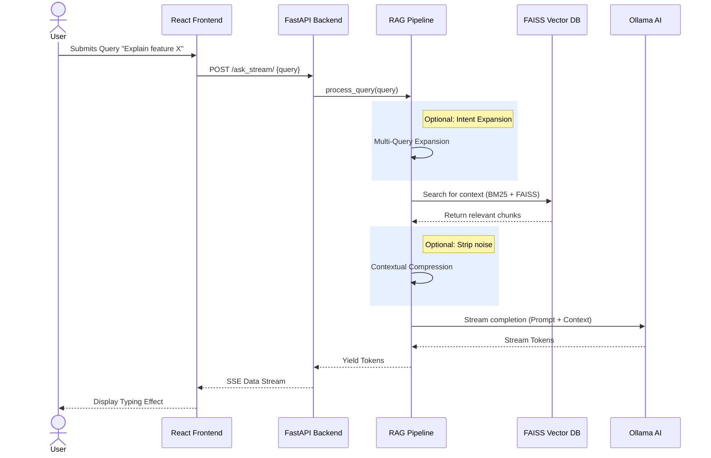
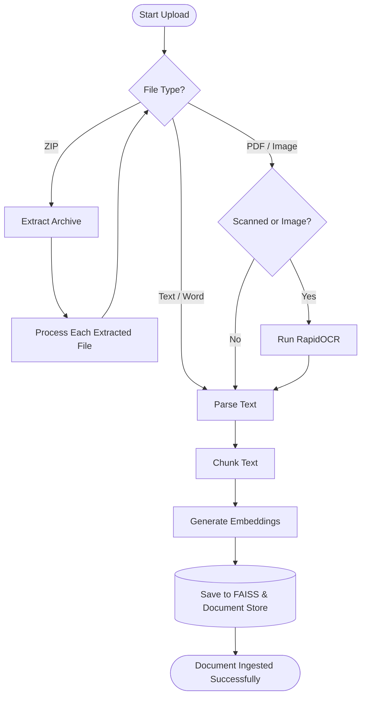

# ZIP-RAG v2.0 Diagrams

This document visualizes the system architecture, component structures, and flows of the ZIP-RAG offline application.

## 1. System Architecture Diagram
A high-level view showing the relationships between the frontend user interface, the FastAPI backend services, local data storage, and external systems (like local LLMs and Web Search).

## 2. Class Diagram
Illustrates the main internal entities in the backend Python application and how they depend on each other.

## 3. Use Case Diagram
Maps out the typical interactions of a User within the ZIP-RAG application.

## 4. Sequence Diagram
Demonstrates the chronological sequence of events when a User submits a question using the RAG capability.

## 5. Activity Diagram
Shows the flow of steps during a document upload and ingestion process.

